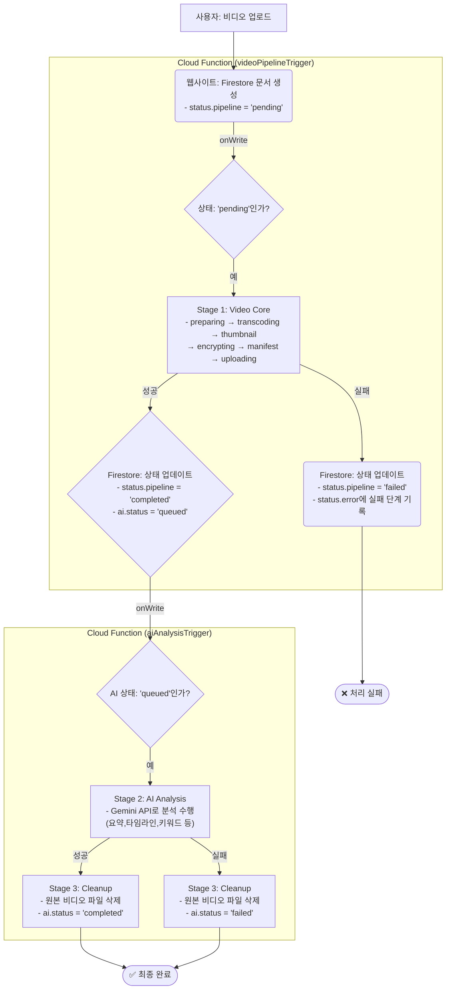

# [공식] LlineStream 비디오 시스템 워크플로우 (v8.1 - 2단계 분리형)

**문서 목표:** 비디오 업로드부터 암호화, AI 분석까지 이어지는 전 과정을 기술적으로 명세합니다. 이 문서는 현재 배포된 코드를 100% 기반으로 분석한 결과이며, 두 개의 독립적인 Cloud 함수가 Firestore 문서의 '상태' 변화를 감지하며 각 단계를 수행하는 '2단계 분리형' 아키텍처의 최종 설계도입니다.

---

## 1. 아키텍처 개요 (2-Stage Decoupled Pattern)

두 개의 독립된 Cloud 함수(`videoPipelineTrigger`, `aiAnalysisTrigger`)가 각각 Firestore의 `episodes` 컬렉션 문서 변경을 감시합니다. 각 함수는 특정 상태(`status.pipeline` 또는 `ai.status`)가 자신이 처리해야 할 조건과 일치할 때만 활성화되어 작업을 수행합니다. 이를 통해 긴 작업을 분리하여 타임아웃을 방지하고 안정성을 확보합니다.

---

## 2. 함수별 동작 상세 분석 (100% 코드 기반)

### **`videoPipelineTrigger` (1단계: 비디오 처리)**

*   **역할:** 비디오를 재생 가능한 상태로 만드는 모든 작업을 담당합니다.
*   **트리거 조건:** `episodes` 문서가 업데이트될 때 실행되며, 내부적으로 `before.status.pipeline`과 `after.status.pipeline`을 비교하여 상태가 `'pending'`으로 **새롭게 변경되었을 때만** 핵심 로직을 수행합니다. (무한 루프 방지)

*   **핵심 로직 (Micro-State 기반 추적):**
    1.  **[마이크로 스테이트: `preparing`]**: 함수가 시작되면 가장 먼저 `status.step`을 `'preparing'`으로 업데이트합니다. `storage.rawPath`에 지정된 원본 파일을 임시 폴더(`/tmp`)로 다운로드합니다.
    2.  **[마이크로 스테이트: `transcoding`]**: `status.step`을 `'transcoding'`으로 업데이트하고, `ffmpeg`을 사용하여 원본 비디오를 스트리밍에 적합한 H.264 코덱의 fMP4 포맷으로 변환하고, 4초 단위의 DASH 세그먼트(`init.mp4`, `segment_*.m4s`)로 분할합니다. 이 과정에서 영상의 정확한 `duration`(재생 시간)을 추출하여 Firestore에 기록합니다.
    3.  **[마이크로 스테이트: `thumbnail`]**: `status.step`을 `'thumbnail'`으로 업데이트합니다. `ffmpeg`을 사용하여 영상의 50% 지점에서 썸네일을 추출하고 `thumbnails.default` 및 `thumbnails.defaultPath` 필드를 업데이트합니다.
    4.  **[마이크로 스테이트: `encrypting`]**: `status.step`을 `'encrypting'`으로 업데이트합니다. 생성된 모든 세그먼트 파일을 `AES-256-GCM` 알고리즘으로 암호화합니다. 이때 각 파일의 Storage 경로(`path:${storagePath}`)가 무결성 검증(AAD)에 사용됩니다.
    5.  **[마이크로 스테이트: `manifest`]**: `status.step`을 `'manifest'`으로 업데이트합니다. 암호화된 세그먼트 경로와 코덱 정보가 포함된 `manifest.json` 파일을 생성합니다.
    6.  **[마이크로 스테이트: `uploading`]**: `status.step`을 `'uploading'`으로 업데이트합니다. 생성된 `manifest.json`과 기본 썸네일 파일을 스토리지에 업로드하고, 비디오 암호화에 사용된 '마스터 키'를 서버의 'KEK'로 다시 암호화하여 `video_keys` 컬렉션에 안전하게 저장합니다.

*   **성공 시:**
    *   `status.pipeline`을 `'completed'`로, `status.playable`을 `true`로 설정합니다.
    *   **`ai.status`를 `'queued'`로 변경하여 `aiAnalysisTrigger` 함수를 호출하는 신호를 보냅니다.**
    *   이후 함수는 즉시 종료됩니다.

*   **실패 시:**
    *   `try-catch` 구문이 에러를 감지하면, `failPipeline` 함수가 호출됩니다.
    *   이 함수는 **문제가 발생한 정확한 마이크로 스테이트(`currentStep`)**와 오류 메시지를 Firestore 문서의 `status.error` 필드에 기록하고 `status.pipeline`을 `'failed'`로 설정합니다.

### **`aiAnalysisTrigger` (2단계: AI 분석 및 정리)**

*   **역할:** AI 분석과 후속 정리 작업을 담당합니다.
*   **트리거 조건:** `episodes` 문서가 업데이트될 때 실행되며, 내부적으로 `before.ai.status`와 `after.ai.status`를 비교하여 상태가 `'queued'`로 **새롭게 변경되었을 때만** 핵심 로직을 수행합니다.

*   **핵심 로직 (`runAiAnalysis` 및 `finally` 블록):**
    1.  **[Stage 2: AI Analysis]**:
        *   `ai.status`를 `'processing'`으로 변경합니다.
        *   `storage.rawPath`에 있는 원본 비디오 파일을 Google AI 파일 관리자에 업로드하고 처리될 때까지 대기합니다.
        *   `gemini-2.5-flash` 모델을 호출하여 **요약(summary), 타임라인(timeline), 전체 대본(transcript), 키워드(keywords), 주제(topics)**를 포함하는 JSON 데이터를 요청합니다.
        *   성공 시, AI가 생성한 전체 JSON 데이터를 `search_data.json` 파일로 Storage에 저장하고, 파일 경로를 `ai.resultPaths.search_data`에 기록합니다.
        *   `ai.status`를 `'completed'`로 업데이트합니다.

    2.  **[Stage 3: Cleanup]**:
        *   `runAiAnalysis` 함수의 **성공 여부와 관계없이**, `aiAnalysisTrigger` 함수의 `finally` 블록에서 **반드시 실행됩니다.**
        *   더 이상 필요 없는 원본 비디오 파일(`storage.rawPath`)을 Storage에서 영구적으로 삭제하고, Firestore 문서에서도 해당 필드를 제거합니다.
        *   `/tmp` 디렉토리를 정리하여 임시 파일을 모두 제거합니다.

*   **중요:** 이 함수의 실패는 `ai.status`를 `'failed'`로 바꿀 뿐, 이미 `true`로 설정된 `status.playable` 상태에는 영향을 주지 않습니다.

### **`deleteFilesOnEpisodeDelete` (정리 함수)**

*   **역할:** 에피소드와 관련된 모든 서버 리소스를 삭제합니다.
*   **트리거 조건:** Firestore에서 `episodes/{episodeId}` 문서가 삭제될 때 자동으로 실행됩니다.
*   **처리 내용:**
    1.  Storage에서 `episodes/{episodeId}/` 경로 하위의 모든 파일(암호화된 세그먼트, 썸네일, AI 결과 등)을 삭제합니다.
    2.  `video_keys` 컬렉션에서 해당 비디오의 암호화 키 문서를 찾아 삭제합니다.
