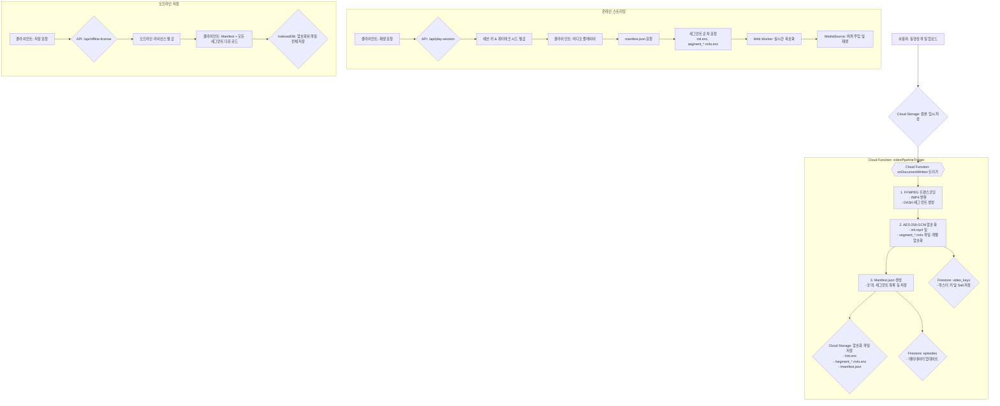

# [공식] LlineStream 비디오 시스템 워크플로우 (v6.1 - DASH)

**문서 목표:** 비디오 업로드부터 암호화, 온라인 스트리밍, 오프라인 재생, 워터마킹에 이르는 전 과정을 기술적으로 명세합니다. 이 문서는 시스템의 현재 구현 상태를 100% 반영하며, 모든 개발 및 유지보수의 기준점이 됩니다.

---

## 1. 아키텍처 개요

LlineStream은 `DASH (Dynamic Adaptive Streaming over HTTP)` 표준과 유사한 세그먼트 기반 스트리밍 방식을 채택하여, 업계 표준 기술을 통해 안정적이고 효율적인 보안 스트리밍을 구현합니다.



---

## 2. 서버 측 처리 파이프라인 (Cloud Function)

모든 서버 측 처리는 `functions/src/index.ts`의 `videoPipelineTrigger` 함수에 의해 트리거되어 `processAndEncryptVideo` 함수에서 실행됩니다.

**주요 코드:** `functions/src/index.ts`

### 단계 1: FFmpeg 트랜스코딩 및 DASH 분할

업로드된 원본 비디오는 단일 FFmpeg 명령어를 통해 스트리밍에 최적화된 포맷으로 변환 및 분할됩니다.

-   **입력:** 모든 포맷의 비디오 파일
-   **출력:** `init.mp4` (초기화 세그먼트), `segment_*.m4s` (4초 단위 미디어 세그먼트)
-   **핵심 로직:**
    -   **Pass 1 & 2 통합:** `-f dash` 옵션을 사용하여 변환과 분할을 한 번에 처리합니다. 이 방식은 MSE 표준을 100% 준수하는 `init`과 `media` 세그먼트를 생성합니다.
    -   **GOP 고정:** `-g 48 -keyint_min 48` 옵션으로 키프레임 간격을 2초(24fps 기준)로 고정하여 정확한 탐색(seeking)을 보장합니다.
    -   **오디오 처리:** 비디오 파일에 오디오 트랙이 존재하는 경우에만 오디오 코덱(`aac`) 변환을 실행하여 오류를 방지합니다.

```typescript
// (functions/src/index.ts) - ffmpeg 실행 부분
// Pass 1: Transcoding to fragmented MP4
await new Promise<void>((resolve, reject) => {
    const command = ffmpeg(localInputPath).videoCodec('libx264');
    // **수정됨**: 오디오 스트림이 있을 때만 오디오 코덱을 추가합니다.
    if (audioStream) {
        command.audioCodec('aac');
    }
    command
        .outputOptions([
            '-profile:v baseline',
            '-level 3.0',
            '-pix_fmt yuv420p',
            '-g 48', // GOP size
            '-keyint_min 48', 
            '-sc_threshold 0',
            '-movflags frag_keyframe+empty_moov' 
        ])
        .toFormat('mp4')
        .on('error', (err) => reject(new Error(`ffmpeg transcoding failed: ${err.message}`)))
        .on('end', () => resolve())
        .save(fragmentedMp4Path);
});

// Pass 2: Splitting into DASH segments
await new Promise<void>((resolve, reject) => {
    ffmpeg(fragmentedMp4Path)
        .outputOptions([
            '-f dash',
            '-seg_duration 4',
            '-init_seg_name init.mp4',
            `-media_seg_name segment_%d.m4s`,
        ])
        .on('error', (err) => reject(new Error(`ffmpeg DASH segmentation failed: ${err.message}`)))
        .on('end', () => resolve())
        .save(path.join(tempOutputDir, 'manifest.mpd')); // mpd는 사용 안 함
});
```

### 단계 2: 세그먼트 단위 암호화

생성된 각 세그먼트(`init.mp4`, `segment_*.m4s`)는 개별적으로 암호화됩니다.

-   **알고리즘:** `AES-256-GCM`
-   **구조:** `[IV (12바이트)][암호화된 데이터 + 인증 태그 (16바이트)]`
-   **무결성 검증 (AAD):** 데이터 변조를 방지하기 위해, 각 세그먼트의 전체 스토리지 경로(`path:episodes/.../segment_1.m4s.enc`)를 AAD(추가 인증 데이터)로 사용합니다.

```typescript
// (functions/src/index.ts) - 암호화 루프
const aad = Buffer.from(`path:${storagePath}`); // AAD 설정
cipher.setAAD(aad);

const encryptedContent = Buffer.concat([cipher.update(content), cipher.final()]);
const authTag = cipher.getAuthTag();

const finalBuffer = Buffer.concat([iv, encryptedContent, authTag]);

// ...
await bucket.file(storagePath).save(finalBuffer, ...);
```

### 단계 3: 키 관리 및 저장

-   **마스터 키:** 각 비디오마다 고유한 `masterKey`가 `crypto.randomBytes(32)`로 생성됩니다.
-   **Salt:** 각 비디오마다 고유한 `salt`가 `crypto.randomBytes(16)`로 생성됩니다. 이 `salt`는 오프라인 라이선스 키를 파생하는 데 사용됩니다.
-   **KEK (Key Encryption Key):** `KEK_SECRET` 환경 변수에서 로드된 최상위 키(KEK)는 `masterKey`를 암호화하는 데 사용됩니다.
-   **저장:** KEK로 암호화된 `masterKey`와 `salt`는 `video_keys` 컬렉션에 해당 비디오의 `keyId`와 함께 저장됩니다.

```typescript
// (functions/src/index.ts) - 마스터 키 암호화 및 저장
const masterKey = crypto.randomBytes(32);
const salt = crypto.randomBytes(16);
// ... KEK로 masterKey 암호화 ...

await db.collection('video_keys').doc(keyId).set({
    keyId,
    videoId: episodeId,
    encryptedMasterKey: encryptedMasterKeyBlob.toString('base64'),
    salt: salt.toString('base64'), // Salt 저장
    kekVersion: 1,
    createdAt: admin.firestore.FieldValue.serverTimestamp(),
});
```

---

## 3. 온라인 스트리밍 재생

**주요 파일:** `src/components/shared/video-player-dialog.tsx`, `src/workers/crypto.worker.ts`

### 단계 1: 세션 키 및 정보 요청

-   **API:** `/api/play-session`
-   **응답 (핵심):**
    -   `derivedKeyB64`: 마스터 키와 사용자 정보로 파생된 **일회성 암호 해독 키**.
    -   `watermarkSeed`: 워터마크 생성을 위한 고유 시드.

### 단계 2: MediaSource 초기화 및 세그먼트 주입

-   `MediaSource` 객체를 생성하여 `<video>` 엘리먼트에 연결합니다.
-   `manifest.json`을 fetch하여 코덱 정보와 세그먼트 목록을 가져옵니다.
-   `init.enc` 세그먼트를 **가장 먼저** fetch하여 Web Worker로 보내 복호화하고, `sourceBuffer`에 주입합니다.
-   `updateend` 이벤트를 리스닝하여, 주입이 완료될 때마다 다음 미디어 세그먼트를 순차적으로 처리합니다.

### 단계 3: Web Worker에서의 실시간 복호화

-   메인 스레드의 부담을 줄이기 위해, 모든 암호 해독은 백그라운드의 Web Worker에서 수행됩니다.
-   **핵심 로직:** 서버에서 암호화할 때 사용했던 것과 동일한 `AAD(path:...)`를 사용하여 데이터 무결성을 검증하며 복호화합니다.

```typescript
// (crypto.worker.ts) - 일부
const { encryptedSegment, derivedKeyB64, encryption, storagePath } = event.data.payload;

const cryptoKey = await importKey(...);
// AAD는 세그먼트의 전체 스토리지 경로를 사용합니다.
const aad = new TextEncoder().encode(`path:${storagePath}`);

const iv = encryptedSegment.slice(0, encryption.ivLength);
const ciphertextWithTag = encryptedSegment.slice(encryption.ivLength);

const decryptedSegment = await self.crypto.subtle.decrypt(
  {
    name: 'AES-GCM',
    iv: iv,
    tagLength: encryption.tagLength * 8,
    additionalData: aad, // AAD 검증
  },
  cryptoKey,
  ciphertextWithTag
);
// ...
```

---

## 4. 오프라인 저장 및 재생

### 단계 1: 오프라인 라이선스 요청

-   **API:** `/api/offline-license`
-   **응답 (핵심):**
    -   `offlineDerivedKey`: 마스터 키, Salt, 사용자/기기 정보로 파생된 **오프라인 전용 암호 해독 키**.
    -   `expiresAt`: 7일 후 만료되는 타임스탬프.

### 단계 2: 콘텐츠 다운로드 및 IndexedDB 저장

-   `manifest.json` 파일을 다운로드합니다.
-   Manifest에 명시된 모든 세그먼트(`init.enc`, `segment_*.m4s.enc`)를 다운로드합니다.
-   에피소드 정보, 라이선스, Manifest, 그리고 모든 세그먼트 데이터(`Map<path, ArrayBuffer>`)를 하나의 객체로 묶어 IndexedDB에 저장합니다.

### 단계 3: 오프라인 재생

-   플레이어는 네트워크 대신 IndexedDB에서 `OfflineVideoData`를 로드합니다.
-   온라인 스트리밍과 **완전히 동일한 MSE 로직**을 사용하되, `fetch`하는 대신 IndexedDB의 `segments` 맵에서 암호화된 세그먼트 버퍼를 직접 가져와 Web Worker로 전달하여 재생합니다.

---

## 5. 워터마크 시스템

-   **시드 생성:** 온라인/오프라인 세션 발급 시, 서버는 `userId`, `videoId`, `deviceId` 등을 조합하여 고유한 `watermarkSeed` (SHA-256 해시)를 생성하여 클라이언트에 전달합니다.
-   **렌더링:** `<Watermark />` 컴포넌트는 이 시드를 사용하여, 비디오 위에 여러 개의 반투명 텍스트 오버레이를 무작위 위치에 렌더링합니다. 이 방식은 비디오 원본을 훼손하지 않으면서도 불법 복제 시 사용자를 특정할 수 있습니다.
