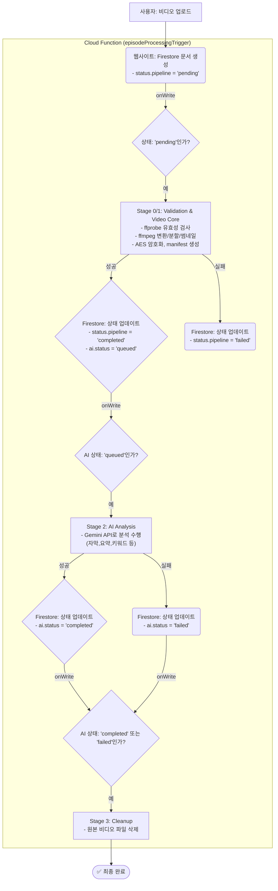

# [공식] LlineStream 비디오 시스템 워크플로우 (v8.1 - 단일 함수 상태 머신)

**문서 목표:** 비디오 업로드부터 암호화, AI 분석까지 이어지는 전 과정을 기술적으로 명세합니다. 이 문서는 `episodeProcessingTrigger`라는 단일 Cloud 함수가 Firestore 문서의 '상태' 변화를 감지하며 모든 단계를 순차적으로 실행하는 '상태 머신' 아키텍처의 최종 설계도입니다.

---

## 1. 아키텍처 개요 (State Machine Pattern)

하나의 Cloud 함수(`episodeProcessingTrigger`)가 Firestore의 `episodes` 컬렉션에 발생하는 모든 쓰기(create, update) 이벤트를 감지합니다. 함수는 문서의 `status.pipeline`과 `ai.status` 필드를 읽어 현재 어떤 단계를 수행해야 할지 결정하고, 해당 단계의 로직만 실행한 후 종료됩니다. 단계가 성공하면 다음 단계를 위한 상태로 문서를 업데이트하며, 이 업데이트가 다시 함수를 트리거하여 다음 단계가 실행됩니다.

**핵심 원칙: 상태 변경 없음 조기 종료 (Loop Prevention)**
- 함수 맨 위에서, 이전 상태와 현재 상태를 비교하여 `status.pipeline`과 `ai.status`에 변화가 없으면, 더 이상의 로직을 실행하지 않고 즉시 종료합니다. 이는 불필요한 함수 실행과 잠재적인 무한 루프를 방지하는 핵심적인 방어 코드입니다.

---

## 2. 단계별 상태 전이 및 핵심 로직

### **Stage 0: 유효성 검사 (Validation)**
- **트리거 조건**: `status.pipeline`이 **`'pending'`** 일 때 실행.
- **핵심 작업**:
    1. Firestore 문서에 `storage.rawPath` 필드가 존재하는지 확인합니다.
    2. 해당 경로에 실제 파일이 Storage에 존재하는지 확인합니다.
- **실패 시**: `status.pipeline`을 `'failed'`로, `status.error`에 원인("RawPath Missing" 등)을 기록하고 즉시 종료합니다.

### **Stage 1: 비디오 코어 처리 (Video Core Processing)**
- **트리거 조건**: 유효성 검사 통과 후 즉시 실행.
- **핵심 작업 (마이크로 스테이트):**
    - **`preparing`**: 원본 비디오를 임시 폴더로 다운로드.
    - **`validate`**: `ffprobe`로 비디오/오디오 스트림 및 재생 시간(duration) 정보 추출.
    - **`transcoding`**: `ffmpeg`을 사용하여 1080p 해상도의 H.264 fMP4 포맷으로 변환하고 4초 단위로 분할.
    - **`thumbnail`**: `ffmpeg`으로 비디오 50% 지점의 스크린샷을 찍어 `thumbnails.default` 썸네일 생성.
    - **`encrypting`**: 각 세그먼트 파일을 `AES-256-GCM`으로 암호화.
    - **`manifest`**: `manifest.json` 생성.
    - **`uploading`**: 암호화된 세그먼트, `manifest.json`, 생성된 썸네일, `video_keys`를 각각 Storage와 Firestore에 저장.
- **성공 시**: `status.pipeline`을 **`'completed'`**로, `status.playable`을 `true`로, 그리고 `ai.status`를 **`'queued'`**로 업데이트하여 비디오가 재생 가능함을 알리고 AI 분석 단계를 준비합니다.
- **실패 시**: `status.pipeline`을 `'failed'`로, `status.playable`을 `false`로 설정하고 **실패가 발생한 정확한 마이크로 스테이트(`step`)**와 오류 정보를 기록합니다.

### **Stage 2: AI 분석 (AI Intelligence)**
- **트리거 조건**: `ai.status`가 **`'queued'`**로 업데이트될 때 실행.
- **핵심 작업**: 원본 비디오를 Gemini AI 모델로 보내 요약, 대본, 타임라인, 검색용 키워드 등을 포함한 **단일 JSON 파일**을 생성하고 Storage에 저장합니다.
- **성공 시**: `ai.status`를 **`'completed'`**로 업데이트합니다.
- **실패 시**: `ai.status`를 `'failed'`로 업데이트하고 AI 관련 오류만 기록합니다. **이 단계의 실패는 `status.playable`에 영향을 주지 않습니다.**

### **Stage 3: 최종 정리 (Cleanup)**
- **트리거 조건**: `ai.status`가 **`'completed'`** 또는 **`'failed'`**로 업데이트될 때 실행.
- **핵심 작업**: 더 이상 필요 없는 원본 비디오 파일(`storage.rawPath`)을 Storage에서 영구적으로 삭제하고 Firestore 문서에서도 해당 필드를 제거합니다.
- **완료 후**: 모든 작업이 종료됩니다.

---

## 3. 안정성 및 오류 처리
- **단계별 격리**: 각 단계의 성공과 실패는 Firestore 문서의 상태 필드(`status.pipeline`, `ai.status`)에 독립적으로 기록됩니다.
- **명확한 오류 추적**: `status.error.step` 필드를 통해 어느 마이크로 스테이트(예: 'transcoding', 'encrypting')에서 문제가 발생했는지 정확하게 파악할 수 있습니다.
- **재생 연속성**: AI 분석(Stage 2)이 실패하더라도 비디오 코어 처리(Stage 1)가 성공했다면, 비디오는 정상적으로 재생할 수 있습니다.
- **자원 관리**: 각 단계의 로직은 `finally` 블록을 통해 임시 파일을 반드시 정리하여 불필요한 스토리지 사용이나 예상치 못한 충돌을 방지합니다.
