# [공식] LlineStream 비디오 시스템 워크플로우 (v7.0 - 다중 트리거 상태 머신)

**문서 목표:** 비디오 업로드부터 암호화, AI 분석까지 이어지는 전 과정을 기술적으로 명세합니다. 이 문서는 각 단계가 독립된 Cloud 함수로 분리되어, Firestore 문서의 '상태' 변화에 따라 순차적으로 실행되는 '상태 머신' 아키텍처의 최종 설계도입니다. 이 구조는 타임아웃 문제를 원천적으로 방지하고, 각 단계의 성공/실패 여부를 명확하게 추적할 수 있도록 합니다.

---

## 1. 아키텍처 개요 (State Machine Pattern)

하나의 거대한 함수 대신, 여러 개의 작고 독립적인 함수가 Firestore 문서의 상태(`status.pipeline`, `status.step`, `ai.status`) 변화를 감지하며 각각의 역할을 수행합니다.

```mermaid
graph TD
    A[사용자: 비디오 업로드] --> B(웹사이트: Firestore 문서 생성<br/>- status.pipeline = 'pending');
    
    subgraph "Cloud Functions (독립 실행)"
        B -- onWrite --> C{상태: 'pending'인가?};
        C -- 예 --> D[1. validationTrigger<br/>- ffprobe로 비디오 유효성 검사];
        D --> E{Firestore: 상태 업데이트<br/>- status.step = 'transcoding_pending'};
        
        E -- onWrite --> F{상태: 'transcoding_pending'인가?};
        F -- 예 --> G[2. transcodingTrigger<br/>- FFmpeg 변환/분할<br/>- 임시 스토리지에 세그먼트 저장];
        G --> H{Firestore: 상태 업데이트<br/>- status.step = 'encryption_pending'};
        
        H -- onWrite --> I{상태: 'encryption_pending'인가?};
        I -- 예 --> J[3. encryptionTrigger<br/>- 임시 세그먼트 다운로드<br/>- AES 암호화 후 최종 저장<br/>- 임시 파일 삭제];
        J --> K{Firestore: 상태 업데이트<br/>- status.step = 'finalization_pending'};

        K -- onWrite --> L{상태: 'finalization_pending'인가?};
        L -- 예 --> M[4. finalizationTrigger<br/>- manifest.json 생성<br/>- 암호화 키 생성 및 KEK로 이중 암호화];
        M --> N{Firestore: 상태 업데이트<br/>- status.pipeline = 'completed'<br/>- ai.status = 'queued'};
        
        N -- onWrite --> O{AI 상태: 'queued'인가?};
        O -- 예 --> P[5. aiAnalysisTrigger<br/>- Gemini API로 AI 분석 수행];
        P --> Q{Firestore: 상태 업데이트<br/>- ai.status = 'completed'};
        
        Q -- onWrite --> R{AI 상태: 'completed'인가?};
        R -- 예 --> S[6. cleanupTrigger<br/>- 원본 비디오 파일 최종 삭제];
    end
    
    S --> T([✅ 최종 완료]);
```

---

## 2. 단계별 상태 전이 및 핵심 로직

### **1단계: `validationTrigger` (유효성 검사)**
-   **트리거 조건**: `episodes` 문서가 생성되고 `status.pipeline`이 **`'pending'`** 일 때 실행.
-   **핵심 작업**: `ffprobe`를 사용하여 비디오 파일이 유효한지, 비디오 스트림이 존재하는지, 재생 시간은 얼마인지 등의 기본 정보를 확인.
-   **완료 후**: `status.step`을 **`'transcoding_pending'`**으로 업데이트.

### **2단계: `transcodingTrigger` (변환 및 분할)**
-   **트리거 조건**: `status.step`이 **`'transcoding_pending'`**으로 업데이트될 때 실행.
-   **핵심 작업**: `ffmpeg`을 사용하여 원본 비디오를 스트리밍에 적합한 fMP4 포맷으로 변환하고, 4초 단위의 DASH 세그먼트(`init.mp4`, `segment_*.m4s`)로 분할. 생성된 파일들을 **암호화되지 않은 상태**로 Storage의 임시 폴더(`temp_unencrypted/`)에 저장.
-   **완료 후**: `status.step`을 **`'encryption_pending'`**으로 업데이트.

### **3단계: `encryptionTrigger` (암호화)**
-   **트리거 조건**: `status.step`이 **`'encryption_pending'`**으로 업데이트될 때 실행.
-   **핵심 작업**: 임시 폴더의 모든 세그먼트 파일들을 다운로드하여 `AES-256-GCM`으로 암호화하고, 최종 목적지(`segments/`)에 업로드. 작업이 끝나면 임시 폴더 삭제.
-   **완료 후**: `status.step`을 **`'finalization_pending'`**으로 업데이트.

### **4단계: `finalizationTrigger` (최종화)**
-   **트리거 조건**: `status.step`이 **`'finalization_pending'`**으로 업데이트될 때 실행.
-   **핵심 작업**:
    1. 암호화된 세그먼트 목록을 바탕으로 `manifest.json` 파일을 생성하여 업로드.
    2. 비디오 암호화에 사용된 `masterKey`를 KEK(Key Encryption Key)로 다시 한번 암호화하여 `video_keys` 컬렉션에 안전하게 저장.
-   **완료 후**: `status.pipeline`을 **`'completed'`**로, `ai.status`를 **`'queued'`**로 업데이트하여 비디오가 재생 가능함을 알리고 AI 분석 단계를 준비.

### **5단계: `aiAnalysisTrigger` (AI 분석)**
-   **트리거 조건**: `ai.status`가 **`'queued'`**로 업데이트될 때 실행.
-   **핵심 작업**: 원본 비디오를 Gemini AI 모델로 보내 요약, 대본, 타임라인 등을 생성하고 결과를 Storage에 저장.
-   **완료 후**: `ai.status`를 **`'completed'`**로 업데이트.

### **6단계: `cleanupTrigger` (최종 정리)**
-   **트리거 조건**: `ai.status`가 **`'completed'`**로 업데이트될 때 실행.
-   **핵심 작업**: 더 이상 필요 없는 원본 비디오 파일(`storage.rawPath`)을 Storage에서 영구적으로 삭제하고 Firestore 문서에서도 해당 필드를 제거.
-   **완료 후**: 모든 작업이 종료됩니다.

---

## 3. 안정성 및 오류 처리
-   **독립 실행**: 각 함수는 독립적으로 실행되므로, `ffmpeg` 변환처럼 오래 걸리는 작업이 다른 단계에 영향을 주지 않아 타임아웃 문제를 원천적으로 방지합니다.
-   **명확한 상태 추적**: `status.pipeline`과 `status.step` 필드를 통해 현재 비디오가 어떤 처리 단계에 있는지 명확하게 파악할 수 있습니다.
-   **오류 격리**: 특정 단계(예: `encryptionTrigger`)에서 오류가 발생하면, 해당 단계의 상태(`encrypting`)와 오류 메시지가 Firestore에 기록된 채로 멈춥니다. 이를 통해 어느 부분에서 문제가 발생했는지 즉시 진단하고 조치할 수 있습니다.
