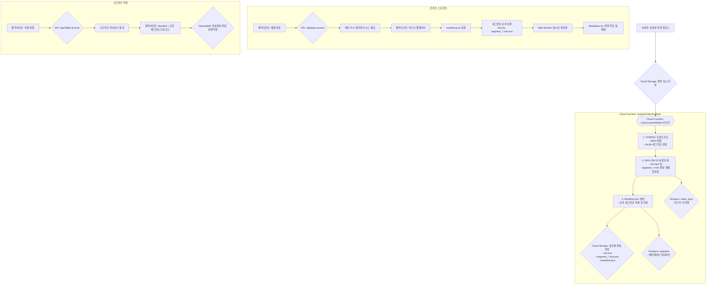

# [공식] LlineStream 비디오 시스템 워크플로우 (v6.1 - DASH)

**문서 목표:** 비디오 업로드부터 암호화, 온라인 스트리밍, 오프라인 재생, 워터마킹에 이르는 전 과정을 기술적으로 명세합니다. 이 문서는 시스템의 현재 구현 상태를 100% 반영하며, 모든 개발 및 유지보수의 기준점이 됩니다.

---

## 1. 아키텍처 개요

LlineStream은 `DASH (Dynamic Adaptive Streaming over HTTP)` 표준과 유사한 세그먼트 기반 스트리밍 방식을 채택하여, 업계 표준 기술을 통해 안정적이고 효율적인 보안 스트리밍을 구현합니다.



---

## 2. 서버 측 처리 파이프라인 (Cloud Function)

모든 서버 측 처리는 `functions/src/index.ts`의 `analyzeVideoOnWrite` 함수에 의해 트리거되어 `processAndEncryptVideo` 함수에서 실행됩니다.

**주요 코드:** `functions/src/index.ts`

### 단계 1: FFmpeg 트랜스코딩 및 DASH 분할

업로드된 원본 비디오는 단일 FFmpeg 명령어를 통해 스트리밍에 최적화된 포맷으로 변환 및 분할됩니다.

-   **입력:** 모든 포맷의 비디오 파일
-   **출력:** `init.mp4` (초기화 세그먼트), `segment_*.m4s` (4초 단위 미디어 세그먼트)
-   **핵심 로직:**
    -   **Pass 1 & 2 통합:** `-f dash` 옵션을 사용하여 변환과 분할을 한 번에 처리합니다. 이 방식은 MSE 표준을 100% 준수하는 `init`과 `media` 세그먼트를 생성합니다.
    -   **GOP 고정:** `-g 48 -keyint_min 48` 옵션으로 키프레임 간격을 2초(24fps 기준)로 고정하여 정확한 탐색(seeking)을 보장합니다.

```typescript
// (functions/src/index.ts) - ffmpeg 실행 부분
// Pass 1: Transcoding to fragmented MP4
await new Promise<void>((resolve, reject) => {
    ffmpeg(localInputPath)
        .videoCodec('libx264')
        .audioCodec('aac')
        .outputOptions([
            '-profile:v baseline',
            '-level 3.0',
            '-pix_fmt yuv420p',
            '-g 48', // GOP size
            '-keyint_min 48', 
            '-sc_threshold 0',
            '-movflags frag_keyframe+empty_moov' 
        ])
        .toFormat('mp4')
        .on('start', (commandLine) => console.log(`🚀 FFMPEG TRANSCODE COMMAND: ${commandLine}`))
        .on('error', (err) => reject(new Error(`ffmpeg transcoding failed: ${err.message}`)))
        .on('end', () => resolve())
        .save(fragmentedMp4Path);
});

// Pass 2: Splitting into DASH segments
await new Promise<void>((resolve, reject) => {
    ffmpeg(fragmentedMp4Path)
        .outputOptions([
            // '-c copy', // REMOVED for robustness
            '-f dash',
            '-seg_duration 4',
            '-init_seg_name init.mp4',
            `-media_seg_name segment_%d.m4s`,
        ])
        .on('start', (commandLine) => console.log(`🚀 FFMPEG DASH SEGMENT COMMAND: ${commandLine}`))
        .on('error', (err) => reject(new Error(`ffmpeg DASH segmentation failed: ${err.message}`)))
        .on('end', () => resolve())
        .save(path.join(tempOutputDir, 'manifest.mpd')); // mpd는 사용 안 함
});
```

### 단계 2: 세그먼트 단위 암호화

생성된 각 세그먼트(`init.mp4`, `segment_*.m4s`)는 개별적으로 암호화됩니다.

-   **알고리즘:** `AES-256-GCM`
-   **구조:** `[IV (12바이트)][암호화된 데이터 + 인증 태그 (16바이트)]`
-   **무결성 검증 (AAD):** `fragment-index` 값을 AAD(추가 인증 데이터)로 사용하여 데이터 변조를 방지합니다.

```typescript
// (functions/src/index.ts) - 암호화 루프
for (const [index, fileName] of allSegmentsToProcess.entries()) {
    const content = await fs.readFile(localFilePath);
    
    const iv = crypto.randomBytes(12);
    const cipher = crypto.createCipheriv('aes-256-gcm', masterKey, iv);
    // AAD 설정
    cipher.setAAD(Buffer.from(`fragment-index:${index}`)); 
    
    const encryptedContent = Buffer.concat([cipher.update(content), cipher.final()]);
    const authTag = cipher.getAuthTag();
    
    const finalBuffer = Buffer.concat([iv, encryptedContent, authTag]);

    // 크기 검증
    if (finalBuffer.length !== content.length + 28) {
        throw new Error(`❌ Encryption size mismatch for ${fileName}`);
    }
    
    await bucket.file(storagePath).save(finalBuffer, { contentType: 'application/octet-stream' });
}
```

### 단계 3: 키 관리 및 저장

-   **마스터 키:** 각 비디오마다 고유한 `masterKey`가 `crypto.randomBytes(32)`로 생성됩니다.
-   **KEK (Key Encryption Key):** `KEK_SECRET` 환경 변수에서 로드된 최상위 키(KEK)는 `masterKey`를 암호화하는 데 사용됩니다.
-   **저장:** KEK로 암호화된 `masterKey`는 `video_keys` 컬렉션에 해당 비디오의 `keyId`와 함께 저장됩니다.

```typescript
// (functions/src/index.ts) - 마스터 키 암호화 및 저장
const keyId = `vidkey_${episodeId}`;
const kek = await loadKEK(); // KEK_SECRET 로드
const masterKey = crypto.randomBytes(32);

const kekIv = crypto.randomBytes(12);
const kekCipher = crypto.createCipheriv('aes-256-gcm', kek, kekIv);
const encryptedMasterKey = Buffer.concat([kekCipher.update(masterKey), kekCipher.final()]);
const kekAuthTag = kekCipher.getAuthTag();
const encryptedMasterKeyBlob = Buffer.concat([kekIv, encryptedMasterKey, kekAuthTag]);

await db.collection('video_keys').doc(keyId).set({
    keyId,
    videoId: episodeId,
    encryptedMasterKey: encryptedMasterKeyBlob.toString('base64'),
    createdAt: admin.firestore.FieldValue.serverTimestamp(),
});
```

### 단계 4: Manifest 생성 및 Firestore 업데이트

플레이어에 필요한 모든 정보를 담은 `manifest.json` 파일을 생성하고, 에피소드 문서의 상태를 최종 업데이트합니다.

```typescript
// (functions/src/index.ts) - Manifest 생성 및 DB 업데이트
const manifest = {
    codec: codecString,
    duration: Math.round(duration),
    segmentDuration: 4,
    segmentCount: mediaSegmentNames.length,
    init: `episodes/${episodeId}/segments/init.enc`,
    segments: [/* { path: "..." } */],
};
// ... manifest.segments 채우기 ...

const manifestPath = `episodes/${episodeId}/manifest.json`;
await bucket.file(manifestPath).save(JSON.stringify(manifest, null, 2), ...);

const encryptionInfo = {
    algorithm: 'AES-256-GCM',
    ivLength: 12,
    tagLength: 16,
    keyId: keyId,
    fragmentEncrypted: true,
};

await docRef.update({
    duration: Math.round(duration),
    codec: manifest.codec,
    manifestPath: manifestPath,
    encryption: encryptionInfo,
    'status.processing': 'completed',
    'status.playable': true,
});
```

---

## 3. 온라인 스트리밍 재생

**주요 파일:** `src/components/shared/video-player-dialog.tsx`, `src/workers/crypto.worker.ts`

### 단계 1: 세션 키 및 정보 요청

사용자가 재생을 시작하면, 클라이언트는 서버에 임시 세션 키를 요청합니다.

-   **API 엔드포인트:** `/api/play-session`
-   **요청:** `videoId`, `deviceId`
-   **응답 (핵심):**
    -   `derivedKeyB64`: 마스터 키와 사용자 정보로 파생된 **일회성 암호 해독 키**.
    -   `watermarkSeed`: 워터마크 생성을 위한 고유 시드.

### 단계 2: MediaSource 초기화 및 세그먼트 주입

-   `MediaSource` 객체를 생성하여 `<video>` 엘리먼트에 연결합니다.
-   `manifest.json`에 명시된 `codec`이 브라우저에서 지원되는지 `MediaSource.isTypeSupported()`로 확인합니다.
-   `init.enc` 세그먼트를 **가장 먼저** fetch하여 Web Worker로 보내 복호화합니다.
-   복호화된 `init` 데이터를 `sourceBuffer.appendBuffer()`로 주입합니다.
-   `updateend` 이벤트가 발생하면, 다음 미디어 세그먼트(`segment_*.m4s.enc`)를 순차적으로 fetch, 복호화, 주입하는 과정을 반복합니다.

```typescript
// (video-player-dialog.tsx) - 일부
const ms = new MediaSource();
videoRef.current.src = URL.createObjectURL(ms);

ms.addEventListener('sourceopen', async () => {
    // 1. 세션 키, 워터마크 시드, manifest 정보 가져오기
    const sessionData = await fetch('/api/play-session', ...).then(res => res.json());
    const manifest = await fetch(manifestUrl).then(res => res.json());

    // 2. 코덱 확인 및 소스 버퍼 생성
    if (!MediaSource.isTypeSupported(manifest.codec)) {
        throw new Error(`코덱 미지원: ${manifest.codec}`);
    }
    const sourceBuffer = ms.addSourceBuffer(manifest.codec);

    // 3. updateend 이벤트 핸들러: 세그먼트 주입이 완료될 때마다 다음 세그먼트 처리
    sourceBuffer.addEventListener('updateend', () => {
        currentSegmentIndexRef.current++;
        fetchAndProcessNextSegment();
    });

    // 4. 세그먼트 큐 생성 및 첫 세그먼트 처리 시작
    segmentQueueRef.current = [manifest.init, ...manifest.segments.map(s => s.path)];
    fetchAndProcessNextSegment();
});
```

### 단계 3: Web Worker에서의 실시간 복호화

-   메인 스레드의 부담을 줄이기 위해, 모든 암호 해독은 백그라운드의 Web Worker에서 수행됩니다.
-   **핵심 로직:** 서버에서 암호화할 때 사용했던 것과 동일한 `AAD(fragment-index)`를 사용하여 데이터 무결성을 검증하며 복호화합니다.

```typescript
// (crypto.worker.ts) - 일부
const { requestId, encryptedSegment, derivedKeyB64, encryption } = event.data.payload;

const cryptoKey = await importKey(...);
const segmentIndex = parseInt(requestId.split('-').pop() || '0');
const aad = new TextEncoder().encode(`fragment-index:${segmentIndex}`);

const iv = encryptedSegment.slice(0, encryption.ivLength);
const ciphertextWithTag = encryptedSegment.slice(encryption.ivLength);

const decryptedSegment = await self.crypto.subtle.decrypt(
  {
    name: 'AES-GCM',
    iv: iv,
    tagLength: encryption.tagLength * 8,
    additionalData: aad, // AAD 검증
  },
  cryptoKey,
  ciphertextWithTag
);

self.postMessage({ type: 'DECRYPT_SUCCESS', payload: { decryptedSegment } }, [decryptedSegment]);
```

---

## 4. 오프라인 저장 및 재생

### 단계 1: 오프라인 라이선스 요청

-   **API 엔드포인트:** `/api/offline-license`
-   **요청:** `videoId`, `deviceId`
-   **응답 (핵심):** 온라인 세션과 유사하지만, **7일 등 긴 유효기간을 가진** `offlineDerivedKey`와 `expiresAt` 타임스탬프를 포함하는 라이선스 객체를 받습니다.

### 단계 2: 콘텐츠 다운로드 및 IndexedDB 저장

-   `manifest.json` 파일을 다운로드합니다.
-   Manifest에 명시된 `init.enc`와 모든 `segment_*.m4s.enc` 파일을 순차적으로 다운로드합니다.
-   에피소드 정보, 라이선스, Manifest, 그리고 모든 세그먼트 데이터(`Map<path, ArrayBuffer>`)를 하나의 `OfflineVideoData` 객체로 묶어 IndexedDB에 저장합니다.

```typescript
// (video-player-dialog.tsx) - 다운로드 로직 일부
const license = await fetch('/api/offline-license', ...).then(res => res.json());
const manifest = await fetch(manifestUrl).then(res => res.json());

const segmentsMap = new Map<string, ArrayBuffer>();
const allSegmentPaths = [manifest.init, ...manifest.segments.map(s => s.path)];

for (const path of allSegmentPaths) {
    const segmentUrl = await getSignedUrl(token, episode.id, path);
    const segmentData = await fetch(segmentUrl).then(res => res.arrayBuffer());
    segmentsMap.set(path, segmentData);
}

const offlineData: OfflineVideoData = {
    episode,
    courseName: course?.name || '',
    downloadedAt: new Date(),
    license,
    manifest,
    segments: segmentsMap,
};

await saveVideo(offlineData); // IndexedDB에 저장 (lib/offline-db.ts)
```

### 단계 3: 오프라인 재생

-   플레이어는 네트워크 대신 IndexedDB에서 `OfflineVideoData`를 로드합니다.
-   온라인 스트리밍과 **완전히 동일한 MSE 로직**을 사용하되, `fetch`하는 대신 `segments` 맵에서 암호화된 세그먼트 버퍼를 직접 가져와 Web Worker로 전달하여 재생합니다.

---

## 5. 워터마크 시스템

-   **시드 생성:** 온라인/오프라인 세션 발급 시, 서버는 `userId`, `videoId`, `deviceId` 등을 조합하여 고유한 `watermarkSeed` (SHA-256 해시)를 생성하여 클라이언트에 전달합니다.
-   **렌더링:** `<Watermark />` 컴포넌트는 이 시드를 사용하여, 비디오 위에 여러 개의 반투명 텍스트 오버레이를 무작위 위치에 렌더링합니다. 이 방식은 비디오 원본을 훼손하지 않으면서도 불법 복제 시 사용자를 특정할 수 있는 효과적인 방법입니다.

```tsx
// (video-player-dialog.tsx) - 워터마크 컴포넌트 사용 예시
const Watermark = ({ seed }: { seed: string | null }) => {
    // ... (useState와 useEffect로 무작위 위치 생성) ...
  
    return (
      <div className="absolute inset-0 pointer-events-none z-10">
        {positions.map((pos, i) => (
          <span
            key={i}
            className="absolute text-white/10 text-xs"
            style={{ ...pos, transform: 'rotate(-15deg)' }}
          >
            {seed}
          </span>
        ))}
      </div>
    );
};

// ... Player ...
<Watermark seed={watermarkSeed} />
```
