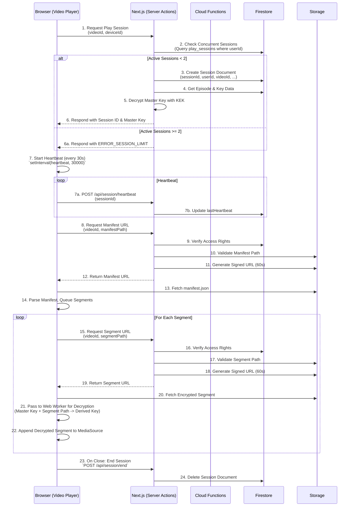

# LlineStream v2: Secure Video Playback Workflow

This document outlines the enhanced security and debugging workflow for video playback.

```mermaid
sequenceDiagram
    participant Client as Browser (Video Player)
    participant Server as Next.js (Server Actions)
    participant Functions as Cloud Functions
    participant Firestore
    participant Storage

    Client->>Server: 1. Request Play Session<br/>(videoId, deviceId)
    Server->>Firestore: 2. Check Concurrent Sessions<br/>(Query play_sessions where userId)
    alt Active Sessions < 2
        Server->>Firestore: 3. Create Session Document<br/>(sessionId, userId, videoId, ...)
        Server->>Firestore: 4. Get Episode & Key Data
        Server->>Server: 5. Decrypt Master Key with KEK
        Server-->>Client: 6. Respond with Session ID & Master Key
    else Active Sessions >= 2
        Server-->>Client: 6a. Respond with ERROR_SESSION_LIMIT
    end

    Client->>Client: 7. Start Heartbeat (every 30s)<br/>`setInterval(heartbeat, 30000)`
    loop Heartbeat
        Client->>Server: 7a. POST /api/session/heartbeat<br/>(sessionId)
        Server->>Firestore: 7b. Update lastHeartbeat
    end

    Client->>Server: 8. Request Manifest URL<br/>(videoId, manifestPath)
    Server->>Firestore: 9. Verify Access Rights
    Server->>Storage: 10. Validate Manifest Path
    Server->>Storage: 11. Generate Signed URL (60s)
    Server-->>Client: 12. Return Manifest URL

    Client->>Storage: 13. Fetch manifest.json
    Client->>Client: 14. Parse Manifest, Queue Segments

    loop For Each Segment
        Client->>Server: 15. Request Segment URL<br/>(videoId, segmentPath)
        Server->>Firestore: 16. Verify Access Rights
        Server->>Storage: 17. Validate Segment Path
        Server->>Storage: 18. Generate Signed URL (60s)
        Server-->>Client: 19. Return Segment URL

        Client->>Storage: 20. Fetch Encrypted Segment
        Client->>Client: 21. Pass to Web Worker for Decryption<br/>(Master Key + Segment Path -> Derived Key)
        Client->>Client: 22. Append Decrypted Segment to MediaSource
    end

    Client->>Server: 23. On Close: End Session<br/>`POST /api/session/end`
    Server->>Firestore: 24. Delete Session Document
```
